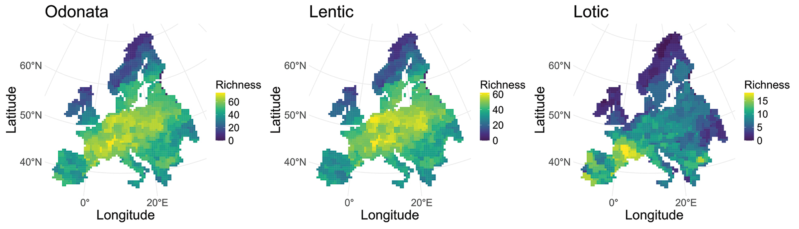

Gómez-Vadillo, M., Calatayud, J., Alves-Martins, F., Ronquillo, C., & Hortal, J. (2025). Ice age, current climate, habitat availability, and the diversity of European dragonflies and damselflies. Frontiers of Biogeography, 18, e136933.

We evaluate whether the variation of dragonfly species richness across Europe is determined by current climate, the climatic conditions during the last ice age, and the availability of freshwater habitats.

-   Dragonfly species richness is higher in Central Europe and decreases both northwards and southwards from there. These variations are primarily determined by current and past climate, and to a lesser extent by habitat availability.

-   Temperature determines the northward decrease in species richness, while the southward decrease is so by precipitation.

-   The last ice age climate had a greater influence than current climate in northern Europe, while in southern Europe current climate has a greater influence, particularly for species related to standing water habitats.

-   Species richness is higher in areas with more rivers and water courses, while the relationship with the availability of standing water habitats is more nuanced.

[📄 Paper](https://biogeography.pensoft.net/article/136933/)\
[💻 Code](https://github.com/mgomezv26/European_odonate_species_richness_2024)

→ Macroecology \| Species richness \| Climate & historical drivers